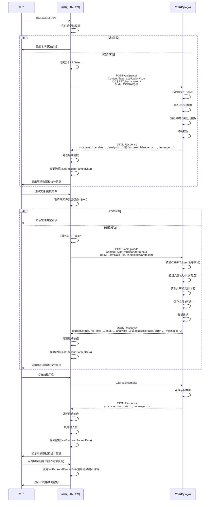
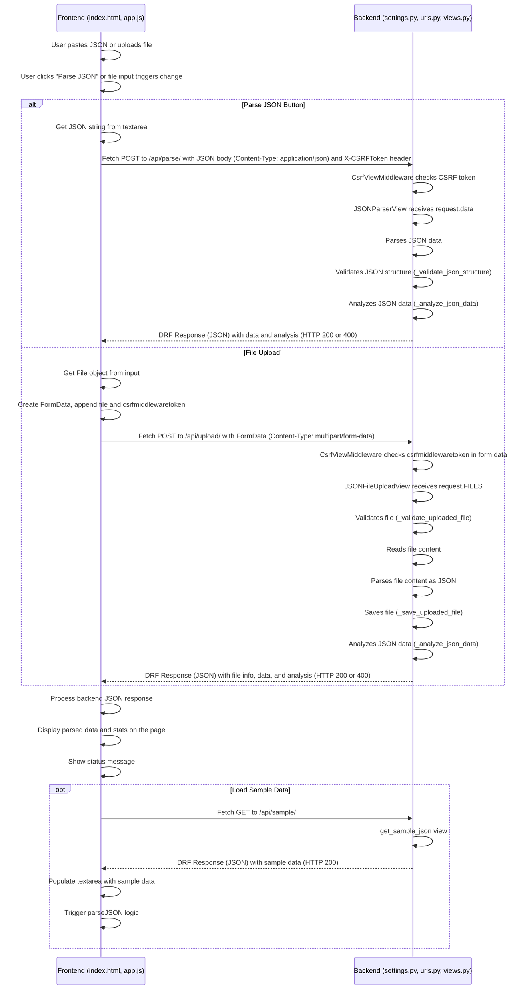

# JSON解析器网页应用设计与实施方案总结文档

## 1. 系统概述与架构

本项目旨在构建一个功能强大的Web端JSON解析器。核心目标是提供一个用户友好的界面，允许用户输入、上传或加载JSON数据，并在客户端进行解析、验证、分析和可视化展示。同时，系统设计包含与Django后端的交互能力，利用后端处理更复杂的任务，如文件上传、后端验证或提供示例数据。

整体系统采用前后端分离架构：

*   前端: 基于标准的HTML、CSS和JavaScript构建，运行在用户的浏览器中。负责用户界面的渲染、用户输入捕获、客户端的基本JSON解析、数据展示逻辑以及通过异步请求与后端API通信。
*   后端: 基于Python和Django框架构建。主要作为API服务提供者，接收前端发送的JSON数据或文件，执行后端特有的处理（如文件存储、更严格的验证、数据分析等），并将处理结果以JSON格式返回给前端。

这种架构提供了良好的模块化、可伸缩性和开发灵活性。前端可以独立开发和部署，后端可以专注于提供稳定可靠的数据处理服务。

```svg
graph LR
    A[用户浏览器] -- 访问index.html --> B(Django Web 服务器)
    B -- 渲染并返回 index.html --> A
    A -- 加载 app.js, CSS --> B
    A -- JSON数据/文件 (通过API) --> C(Django 应用)
    C -- 处理请求 (解析, 验证, 分析, 文件存储) --> D[后端服务/数据库/存储]
    C -- 返回 JSON 响应 --> A
    A -- 在前端展示数据 --> A
```
图 1.1：系统架构示意图

## 2. 前端组件详解

前端是用户直接交互的界面层，由`index.html` (结构)、内嵌及外部CSS (样式) 和`app.js` (逻辑) 组成。

### 2.1 HTML结构 (`index.html`)

`index.html`文件定义了页面的基本布局和各个功能区域：

*   头部 (Header): 包含应用标题和简要描述，使用`gradient-bg`和`glass-effect`类提供视觉效果。
*   主内容区 (Main Content): 使用网格布局 (`grid grid-cols-1 lg:grid-cols-2`) 将页面分为左右两大部分。
    *   输入区:
        *   标题 (`<h2>`) 和图标。
        *   `textarea` (`id="jsonInput"`) 用于粘贴或手动输入JSON字符串。
        *   操作按钮:
            *   解析 JSON (`id="parseBtn"`): 触发将JSON字符串发送至后端解析的操作。
            *   清空 (`id="clearBtn"`): 清空输入框和结果展示区。
            *   加载示例 (`id="loadSampleBtn"`): 从后端加载示例JSON数据。
        *   文件上传区:
            *   虚线边框区域 (`border-dashed`) 作为文件拖拽和点击上传的视觉提示。
            *   隐藏的 `input type="file"` (`id="fileInput"`) 实际处理文件选择。
            *   `label` 元素与 `fileInput` 关联，实现点击虚线区域即可选择文件。
*   展示区:
    *   标题 (`<h2>`) 和图标。
    *   视图模式按钮: (`id="treeViewBtn"`, `rawViewBtn`, `tableViewBtn`) 控制JSON数据展示格式（树形、原始文本、表格）。
    *   状态信息区: (`id="statusDisplay"`) 用于显示操作状态、错误或成功信息，包含图标 (`id="statusIcon"`) 和文本 (`id="statusText"`)。此区域初始隐藏 (`hidden`)。
    *   JSON展示区域: (`id="jsonDisplay"`) 用于动态插入解析或处理后的JSON数据的HTML结构。初始显示占位符内容。
    *   统计信息区: (`id="jsonStats"`) 用于展示JSON数据的统计信息（总属性数、最大深度、数组数量、对象数量等），初始隐藏 (`hidden`)。
*   API集成测试区 (可选/扩展): 包含输入框 (`id="apiUrl"`) 和选择框 (`id="apiMethod"`) 用于测试其他API，以及测试 API (`id="testApiBtn"`) 和加载演示数据 (`id="loadDemoApiBtn"`) 按钮。
*   Django集成指南区: 提供一个简要的文本描述和三个卡片，说明与Django集成的关键方面。
*   底部 (Footer): 包含版权信息。

整个页面结构使用了Tailwind CSS框架提供的类进行样式布局和美化，如 `container`, `mx-auto`, `px-6`, `py-8`, `grid`, `gap-8`, `bg-white`, `rounded-xl`, `shadow-lg`, `p-6`, `flex`, `items-center`, `mb-4`, `w-full`, `h-64`, `border`, `rounded-lg`, `focus:ring-2`, `hover:bg-blue-700` 等。

### 2.2 CSS样式

页面样式主要依赖于引入的Tailwind CSS库。此外，为了实现JSON数据的树形视图可视化和语法高亮，定义了额外的CSS规则：

*   `.json-tree`: 定义了树形视图容器的基本样式，如字体、背景、内边距等。
*   `.json-key`, `.json-string`, `.json-number`, `.json-boolean`, `.json-null`, `.json-bracket`: 为不同类型的JSON值和结构符号定义了不同的颜色和字体样式，实现类似代码编辑器的语法高亮效果。
*   `.json-indent`: 用于在树形视图中创建层级缩进。
*   `.collapsible`: 应用于可折叠的节点（对象或数组的开头 `{`, `[`），定义了光标样式 (`cursor: pointer`) 和悬停效果 (`:hover`)。
*   `.collapsed`: 用于隐藏折叠节点内的内容 (`display: none`)。
*   `.expand-icon`: 用于显示节点的展开/折叠状态图标 (`▼` 或 `▶`)，并通过CSS `transform: rotate(-90deg)` 实现旋转动画。

其他样式如 `gradient-bg` (头部背景) 和 `glass-effect` (玻璃效果) 提供了额外的视觉美化。

### 2.3 JavaScript逻辑 (`app.js`)

`app.js` 是前端的核心，负责所有的动态行为和与后端的交互：

*   类 `JSONParser`: 封装了应用的所有功能。
    *   `constructor()`: 初始化DOM元素引用 (`initializeElements`)，绑定事件监听器 (`bindEvents`)，初始化视图模式 (`currentViewMode`)，并在加载时尝试获取CSRF token (`getCSRFToken`) 以便与Django后端安全交互。
    *   `initializeElements()`: 获取并缓存所有需要操作的DOM元素的引用，避免重复查询。
    *   `bindEvents()`: 为按钮、文件输入等元素绑定事件处理函数，如点击解析、清空、加载示例，文件选择变化，以及视图模式切换。
    *   `setupDragAndDrop()`: 为文件上传区域添加拖拽事件监听器，实现拖拽文件上传功能，并提供视觉反馈。
    *   `parseJSON(input)` (本地解析): 使用 `JSON.parse()` 尝试解析输入的JSON字符串。主要作为快速客户端语法校验或视图切换时的备用解析。如果解析失败，会显示错误信息和常见错误提示。
    *   `displayJSON(data)`: 根据当前的 `currentViewMode` 调用相应的渲染函数 (`createTreeView`, `createTableView`, 或直接显示原始字符串) 将JSON数据展示在 `jsonDisplay` 区域。
    *   `createTreeView(data, depth)`: 递归地将JSON数据结构转换为带有折叠功能的HTML列表结构，并应用语法高亮样式。
    *   `createTableView(data)`: 将JSON数据转换为HTML表格。最适合展示对象数组，对于其他数据类型会显示提示信息或单列表格。会动态确定表头（所有对象的唯一键）。
    *   `bindTreeEvents()`: 为树形视图中的可折叠元素绑定点击事件，实现展开/折叠功能。
    *   `switchViewMode(mode)`: 切换当前的视图模式 (`tree`, `raw`, `table`)，更新按钮的激活状态，并使用之前存储的解析结果 (`lastBackendParsedData`) 重新渲染展示区域。
    *   `showStatus(type, message)`: 在 `statusDisplay` 区域显示不同类型（成功、错误、信息）的状态消息，并包含相应的图标。成功消息会自动隐藏。
    *   `updateStats(analysis)`: 根据后端返回的统计分析数据更新 `jsonStats` 区域的显示内容。
    *   `analyzeJSON(data)` (客户端分析): 作为后端的备用或补充，递归计算客户端解析数据的总属性数、最大深度、数组和对象数量。
    *   `clearAll()`: 清空所有输入、输出和状态显示区域，恢复到初始状态。
    *   `fetchSampleDataFromBackend()`: 使用 `fetch` API 发送 GET 请求到后端 `/api/sample/` 端点，加载示例JSON数据。成功后填充输入框、更新 `lastBackendParsedData`，并调用 `displayJSON` 和 `updateStats` 展示数据和统计信息。处理网络错误和后端返回的应用错误。
    *   `handleFileUpload(event)`: 监听文件输入变化事件。验证文件类型（必须是 `.json`），然后调用 `uploadJsonFileToBackend` 发送文件到后端。
    *   `uploadJsonFileToBackend(file)`: 使用 `fetch` API 发送 POST 请求到后端 `/api/upload/` 端点上传文件。使用 `FormData` 包含文件和CSRF token (`csrfmiddlewaretoken`)。处理网络错误和后端返回的文件处理错误。成功后类似加载示例，展示后端解析的结果。
    *   `sendJsonStringToBackend()`: 获取输入框中的JSON字符串，进行客户端初步语法校验。如果通过，使用 `fetch` API 发送 POST 请求到后端 `/api/parse/` 端点。请求头设置 `Content-Type: application/json` 并包含 CSRF token (`X-CSRFToken`)。处理网络错误和后端返回的解析错误。成功后更新 `lastBackendParsedData`，展示后端解析结果和统计信息。
    *   `getCSRFToken()`: 尝试从cookies (`csrftoken`) 或页面的 `<meta name="csrf-token">` 标签中获取Django的CSRF token，用于后续的POST请求。
    *   `escapeHtml(text)`: 一个工具函数，用于转义HTML特殊字符，防止在将JSON数据插入到HTML中时引起跨站脚本攻击 (XSS)。

*   DOM加载完成监听: `document.addEventListener('DOMContentLoaded', ...)` 确保在页面完全加载并构建DOM树后才初始化 `JSONParser` 类实例，避免操作不存在的元素。

核心交互逻辑依赖于 `fetch` API 进行异步请求，并根据后端返回的JSON响应来更新界面。错误处理被集成到每个异步请求中，以友好的方式向用户显示问题。CSRF token机制被正确地应用到发送POST请求的方法中 (`X-CSRFToken` header for `application/json`, `csrfmiddlewaretoken` field for `multipart/form-data`)，以增强与Django后端的安全性。

## 3. 后端组件详解（Django）

后端基于Django框架提供API服务，主要包含配置、URL路由和视图逻辑。

### 3.1 项目配置 (`django_settings.py`)

`django_settings.py` 是Django项目的核心配置文件，关键配置项包括：

*   `SECRET_KEY`: 用于加密操作的安全密钥，生产环境必须修改。
*   `DEBUG`: 调试模式开关，生产环境应设置为 `False`。
*   `ALLOWED_HOSTS`: 当 `DEBUG=False` 时，必须配置允许访问本站的域名列表。
*   `INSTALLED_APPS`: 注册项目使用的应用，包括Django内置应用、第三方应用 (`rest_framework`, `corsheaders`) 和本地应用 (`json_parser`)。
    ```python
    INSTALLED_APPS = [
        # ... default apps
        'rest_framework', # Django REST Framework
        'corsheaders',    # 处理跨域请求
        'json_parser',    # 本地应用
    ]
    ```
*   `MIDDLEWARE`: 定义请求/响应处理中间件链。`corsheaders.middleware.CorsMiddleware` 必须在顶部以处理跨域。`django.middleware.csrf.CsrfViewMiddleware` 负责CSRF保护（默认已包含且重要）。
    ```python
    MIDDLEWARE = [
        'corsheaders.middleware.CorsMiddleware', # 必须在顶部
        'django.middleware.security.SecurityMiddleware',
        'django.contrib.sessions.middleware.SessionMiddleware',
        'django.middleware.common.CommonMiddleware',
        'django.middleware.csrf.CsrfViewMiddleware', # 默认包含
        # ... other middleware
    ]
    ```
*   `CORS_ALLOWED_ORIGINS` / `CORS_ALLOW_ALL_ORIGINS`: 配置允许跨域访问的前端源地址。`CORS_ALLOW_ALL_ORIGINS = DEBUG` 简化开发环境配置，生产环境应明确列出允许的域名。
*   `REST_FRAMEWORK`: DRF的全局配置，如默认权限类 (`AllowAny` 允许任何人访问API)、认证类、渲染器类 (`JSONRenderer`, `BrowsableAPIRenderer` 方便开发)。
    ```python
    REST_FRAMEWORK = {
        'DEFAULT_PERMISSION_CLASSES': [
            'rest_framework.permissions.AllowAny', # 允许任何用户访问
        ],
        'DEFAULT_RENDERER_CLASSES': [
            'rest_framework.renderers.JSONRenderer', # 返回JSON响应
            'rest_framework.renderers.BrowsableAPIRenderer', # 浏览器友好API视图
        ],
        # ... other DRF settings
    }
    ```
*   `TEMPLATES`: 配置模板查找目录。确保 `BASE_DIR / 'templates'` 包含在 `DIRS` 中，以便找到 `index.html` (如果通过Django视图渲染)。`context_processors` 中应包含 `django.template.context_processors.csrf` (默认包含)，以在模板中使用 ``。
*   `STATIC_URL` / `STATIC_ROOT` / `STATICFILES_DIRS`: 配置静态文件的服务路径和存储位置。前端的 `app.js` 需要通过此机制被Django服务。
*   `MEDIA_URL` / `MEDIA_ROOT`: 配置媒体文件（用户上传文件）的服务路径和存储位置。
*   `JSON_PARSER_SETTINGS`: 自定义字典，用于存放本项目特有的配置，如文件最大大小、允许的扩展名、文件上传路径、是否启用后端验证、最大JSON深度和键数量限制等。这些设置在视图逻辑中被引用。
    ```python
    JSON_PARSER_SETTINGS = {
        'MAX_FILE_SIZE': 10 * 1024 * 1024,  # 10MB
        'ALLOWED_EXTENSIONS': ['.json'],
        'UPLOAD_PATH': 'json_uploads/',
        'ENABLE_VALIDATION': True,
        'MAX_DEPTH': 10,
        'MAX_KEYS': 1000,
        # ... other settings
    }
    ```
*   `LOGGING`: 配置日志系统，将应用运行信息、错误等记录到文件或控制台。
*   安全性相关的其他设置: `SECURE_BROWSER_XSS_FILTER`, `SECURE_CONTENT_TYPE_NOSNIFF`, `X_FRAME_OPTIONS`, `SESSION_COOKIE_SECURE`, `CSRF_COOKIE_SECURE` 等，这些应根据部署环境（HTTP/HTTPS）进行调整。

### 3.2 URL路由 (`django_urls.py`)

`django_urls.py` 文件定义了URL路径与视图函数的映射。推荐的做法是在应用内部 (`json_parser/urls.py`) 定义API路由，然后在项目主 `urls.py` 中引用。

项目主 `urls.py` (`json_parser_project/urls.py`) 包含：

*   `admin/`: Django管理站点的入口。
*   `api/`: 使用 `include('json_parser.urls')` 包含了 `json_parser` 应用内部定义的API路由。
*   `api-auth/`: DRF提供的用于浏览器API视图认证登录的路由（可选）。
*   静态文件和媒体文件服务路由 (仅在 `settings.DEBUG` 为 `True` 时添加，生产环境应由Web服务器处理)。

`json_parser` 应用内部的 `urls.py` (`json_parser/urls.py`) 定义了具体的API端点：

```python
# json_parser/urls.py
from django.urls import path
from . import views

urlpatterns = [
    # API endpoints
    path('parse/', views.JSONParserView.as_view(), name='json_parse'),      # 处理JSON字符串解析请求
    path('upload/', views.JSONFileUploadView.as_view(), name='json_upload'), # 处理文件上传请求
    path('sample/', views.get_sample_json, name='sample_json'),         # 获取示例JSON数据
    path('health/', views.health_check, name='health_check'),         # 健康检查
    # path('simple-parse/', views.simple_json_parse, name='simple_json_parse'), # 函数视图示例 (备选，非DRF APIView)
]
```
这种结构清晰地组织了项目的URL空间，将应用相关的API集中管理。

### 3.3 视图逻辑 (`django_views.py`)

`django_views.py` 文件包含处理前端请求的核心业务逻辑。本项目主要使用了Django REST Framework (DRF) 的 `APIView` 构建类视图来处理API请求，也包含函数视图示例 (`get_sample_json`, `health_check`, `simple_json_parse`)。

*   `JSONParserView(APIView)`:
    *   继承自DRF的 `APIView`。`permission_classes = [AllowAny]` 允许任何未认证的用户访问。
    *   实现了 `post` 方法来处理前端发送的JSON字符串解析请求 (通常 Content-Type 为 `application/json`)。
    *   从 `request.data` 获取JSON数据（DRF已自动处理解析）。
    *   调用 `_validate_json_structure(json_data)` 进行后端结构验证，根据 `settings.JSON_PARSER_SETTINGS` 中配置的 `MAX_DEPTH` 和 `MAX_KEYS` 检查JSON的嵌套深度和总键数量。
    *   调用 `_analyze_json_data(json_data)` 进行后端数据分析，计算总键数、最大深度、数据类型分布、数组/对象数量等统计信息。
    *   使用 `try...except json.JSONDecodeError` 捕获JSON解析本身的错误。
    *   使用 `try...except Exception` 捕获其他潜在错误。
    *   通过 `rest_framework.response.Response` 返回结构化的JSON响应，包含 `success` 状态、`message`、解析后的 `data`、`analysis` 统计信息和 `timestamp`。根据处理结果设置合适的HTTP状态码 (200成功，400客户端错误，500服务器错误)。

    ```python
    class JSONParserView(APIView):
        permission_classes = [AllowAny]

        def post(self, request):
            try:
                # DRF automatically parses JSON body into request.data
                json_data = request.data 

                # Validate JSON structure (depth, key count)
                validation_result = self._validate_json_structure(json_data)
                if not validation_result['is_valid']:
                    return Response({
                        'error': 'JSON validation failed',
                        'message': validation_result['error'],
                        'details': validation_result.get('details', [])
                    }, status=status.HTTP_400_BAD_REQUEST)

                # Analyze JSON data
                analysis = self._analyze_json_data(json_data)

                logger.info(f"JSON parsed successfully. Keys: {analysis['total_keys']}, Depth: {analysis['max_depth']}")

                return Response({
                    'success': True,
                    'message': 'JSON解析成功',
                    'data': json_data,
                    'analysis': analysis,
                    'timestamp': datetime.now().isoformat()
                }, status=status.HTTP_200_OK)

            except json.JSONDecodeError as e:
                # ... handle decode error
                return Response({
                    'error': 'Invalid JSON format',
                    'message': f'JSON格式错误: {str(e)}',
                    # include line/column if available
                }, status=status.HTTP_400_BAD_REQUEST)

            except Exception as e:
                # ... handle other errors
                return Response({
                    'error': 'Internal server error',
                    'message': f'服务器内部错误: {str(e)}'
                }, status=status.HTTP_500_INTERNAL_SERVER_ERROR)

        # Helper methods for validation and analysis (_validate_json_structure, _calculate_json_depth, _count_json_keys, _analyze_json_data, _analyze_data_types, _count_arrays, _count_objects)
        # ... (See provided django_views.py for details)
    ```

*   `JSONFileUploadView(APIView)`:
    *   同样继承自 `APIView`，允许任何用户访问。
    *   实现了 `post` 方法来处理前端发送的包含JSON文件的请求 (Content-Type 通常为 `multipart/form-data`)。
    *   从 `request.FILES` 获取上传的文件对象。
    *   调用 `_validate_uploaded_file(uploaded_file)` 进行文件验证，根据 `settings.JSON_PARSER_SETTINGS` 检查文件大小 (`MAX_FILE_SIZE`) 和扩展名 (`ALLOWED_EXTENSIONS`)。
    *   读取文件内容 (`uploaded_file.read().decode('utf-8')`)。
    *   使用 `json.loads()` 解析文件内容为Python对象。
    *   调用 `_save_uploaded_file(uploaded_file, file_content)` 将文件保存到配置的媒体目录 (`MEDIA_ROOT`) 下的指定路径 (`UPLOAD_PATH`)，生成唯一文件名。
    *   对解析后的数据调用 `JSONParserView()._analyze_json_data()` 进行分析。
    *   使用 `try...except json.JSONDecodeError` 捕获文件内容解析错误。
    *   通过 `Response` 返回成功信息，包含文件信息、解析的数据和分析结果。

    ```python
    class JSONFileUploadView(APIView):
        permission_classes = [AllowAny]

        def post(self, request):
            try:
                uploaded_file = request.FILES.get('json_file') # Get file by name
                if not uploaded_file:
                     return Response({'error': 'No file provided', 'message': '未提供文件'}, status=status.HTTP_400_BAD_REQUEST)

                # Validate file (size, extension)
                validation_result = self._validate_uploaded_file(uploaded_file)
                if not validation_result['is_valid']:
                    return Response({
                        'error': 'File validation failed',
                        'message': validation_result['error']
                    }, status=status.HTTP_400_BAD_REQUEST)

                # Read and parse file content
                file_content = uploaded_file.read().decode('utf-8')
                json_data = json.loads(file_content) # Parse file content

                # Save file (optional but implemented)
                saved_file_info = self._save_uploaded_file(uploaded_file, file_content)

                # Analyze JSON data
                analysis = JSONParserView()._analyze_json_data(json_data) # Use parser view's analysis method

                logger.info(f"JSON file uploaded successfully: {uploaded_file.name}")

                return Response({
                    'success': True,
                    'message': 'JSON文件上传和解析成功',
                    'file_info': saved_file_info,
                    'data': json_data,
                    'analysis': analysis,
                    'timestamp': datetime.now().isoformat()
                }, status=status.HTTP_200_OK)

            except json.JSONDecodeError as e:
                 # ... handle file content decode error
                 return Response({
                     'error': 'Invalid JSON file',
                     'message': f'无效的JSON文件: {str(e)}'
                 }, status=status.HTTP_400_BAD_REQUEST)

            except Exception as e:
                 # ... handle other errors
                 return Response({
                     'error': 'File processing error',
                     'message': f'文件处理错误: {str(e)}'
                 }, status=status.HTTP_500_INTERNAL_SERVER_ERROR)

        # Helper methods for file validation and saving (_validate_uploaded_file, _save_uploaded_file)
        # ... (See provided django_views.py for details)
    ```

*   `get_sample_json` (函数视图):
    *   使用 `@api_view(['GET'])` 和 `@permission_classes([AllowAny])` 装饰器，使其行为类似DRF视图，可以方便地返回 `Response` 对象。
    *   简单返回硬编码的示例JSON数据。

*   `health_check` (函数视图):
    *   同样使用DRF装饰器。
    *   返回一个简单的状态信息，用于服务监控。

*   `simple_json_parse` (函数视图):
    *   这是一个备选的、未使用DRF `APIView` 的函数视图示例。
    *   使用 `@csrf_exempt` 禁用了CSRF保护（注意：生产环境不建议这样做，除非有其他防护措施）。
    *   使用 `@require_http_methods(["POST"])` 限制只接受POST请求。
    *   直接使用 `json.loads(request.body)` 解析请求体。
    *   使用 `django.http.JsonResponse` 返回响应。

日志记录: 在关键操作（如解析成功、错误发生）处使用了配置好的 `logger` 进行日志记录，这对于调试和监控非常重要。

## 4. 前后端交互与数据流

前后端交互主要通过基于HTTP协议的API请求实现，数据以JSON格式进行传递。

### 4.1 数据请求与发送流程

*   前端发送JSON字符串到后端解析 (`/api/parse/`):
    1.  用户在 `jsonInput` 中输入或粘贴JSON数据，点击“解析 JSON”按钮。
    2.  前端JS (`app.js` 的 `sendJsonStringToBackend` 方法) 获取输入框内容。
    3.  客户端初步校验: 使用 `JSON.parse()` 尝试在客户端解析，如果语法错误，立即显示错误，不发送到后端，提供快速反馈。
    4.  如果客户端校验通过，前端JS构造一个 `fetch` POST请求。
    5.  请求头 (`Headers`) 设置 `Content-Type: application/json`。
    6.  CSRF防护: 获取CSRF token (`getCSRFToken` 方法，从cookie或meta标签)，并在请求头中添加 `X-CSRFToken: <token>`。
    7.  请求体 (`body`) 为 `JSON.stringify(parsed_data)`，即JSON字符串。
    8.  请求发送到后端 `/api/parse/` URL。
    9.  后端接收: Django接收到请求，`CsrfViewMiddleware` 检查 `X-CSRFToken` 是否有效。`JSONParserView.as_view()` 处理请求。
    10. 后端处理: 在 `JSONParserView` 的 `post` 方法中，DRF自动将请求体解析为Python对象放入 `request.data`。进行后端结构验证 (`_validate_json_structure`) 和数据分析 (`_analyze_json_data`)。
    11. 后端响应: 根据处理结果，构建包含 `success`, `message`, `data`, `analysis` 等字段的JSON响应，并设置相应的HTTP状态码（200成功，400失败）。
    12. 前端接收: 前端 `fetch` 接收响应，检查 `response.ok` 和响应体中的 `success` 字段。
    13. 前端展示: 如果成功，将后端返回的 `data` (可能是后端验证或处理后的数据) 和 `analysis` 更新到界面上，调用 `displayJSON` 和 `updateStats`，并显示成功状态。如果失败，显示后端返回的错误信息。

*   前端上传JSON文件到后端 (`/api/upload/`):
    1.  用户通过文件选择或拖拽方式选中JSON文件。
    2.  前端JS (`app.js` 的 `handleFileUpload` -> `uploadJsonFileToBackend` 方法) 获取文件对象。
    3.  文件类型校验: 在客户端检查文件扩展名 (`.json`)。
    4.  如果校验通过，构造一个 `fetch` POST请求。
    5.  请求体使用 `FormData` 对象，将文件对象 (`file`) 添加到名为 `json_file` 的字段中。
    6.  CSRF防护: 获取CSRF token，并将其作为一个普通的表单字段 (`csrfmiddlewaretoken`) 添加到 `FormData` 中。对于 `multipart/form-data`，Django默认检查表单字段。
    7.  `Content-Type` 头无需手动设置，浏览器会自动为 `FormData` 设置为 `multipart/form-data` 并包含正确的边界信息。
    8.  请求发送到后端 `/api/upload/` URL。
    9.  后端接收: Django接收请求，`CsrfViewMiddleware` 检查 `csrfmiddlewaretoken` 字段。`JSONFileUploadView.as_view()` 处理请求。
    10. 后端处理: 在 `JSONFileUploadView` 的 `post` 方法中，从 `request.FILES` 获取文件。进行后端文件验证 (`_validate_uploaded_file`)，读取并解析文件内容 (`json.loads`)，保存文件 (`_save_uploaded_file`)，并对解析数据进行分析 (`_analyze_json_data`)。
    11. 后端响应: 返回包含 `success`, `message`, `file_info`, `data`, `analysis` 等字段的JSON响应。
    12. 前端接收与展示: 类似JSON字符串解析流程，根据响应更新界面。

*   前端从后端获取示例数据 (`/api/sample/`):
    1.  用户点击“加载示例”按钮。
    2.  前端JS (`app.js` 的 `fetchSampleDataFromBackend` 方法) 构造一个 `fetch` GET请求。
    3.  请求发送到后端 `/api/sample/` URL。
    4.  后端接收: `get_sample_json` 视图函数处理请求。
    5.  后端处理: 返回硬编码的示例JSON数据和一条消息。
    6.  后端响应: 返回包含 `success`, `message`, `data`, `timestamp` 的JSON响应。
    7.  前端接收: 前端接收响应。
    8.  前端展示: 提取 `data`，填充输入框，更新 `lastBackendParsedData`，调用 `displayJSON` 展示数据，并可以对获取的数据进行客户端分析 (`analyzeJSON`) 更新统计信息（如果后端没有提供）。

### 4.2 数据格式

*   前端发送到后端:
    *   解析JSON字符串 (`/api/parse/`): JSON格式的请求体，`Content-Type: application/json`。
        ```json
        { "key1": "value1", "key2": [1, 2] } 
        ```
    *   上传JSON文件 (`/api/upload/`): `multipart/form-data` 格式的请求体，包含文件字段 (`json_file`) 和 CSRF 字段 (`csrfmiddlewaretoken`)。
*   后端发送到前端:
    *   统一的JSON响应格式，通常包含：
        *   `success` (boolean): 操作是否成功。
        *   `message` (string): 操作结果的描述信息。
        *   `data` (any): 如果操作成功，包含处理后的JSON数据（解析、验证后的结果）。
        *   `analysis` (object, 可选): 包含JSON数据的统计分析结果。
        *   `file_info` (object, 可选): 文件上传成功时，包含保存的文件信息。
        *   `error` (string, 可选): 如果操作失败，包含错误码或类型。
        *   `details` (any, 可选): 错误或验证失败的详细信息。
        *   `timestamp` (string, 可选): 操作时间戳。


图 4.1：主要前后端交互流程图

## 5. 关键技术与最佳实践总结

本项目采用了以下关键技术和实践：

*   技术栈:
    *   前端: HTML, CSS, JavaScript (ES6+), Tailwind CSS, Fetch API.
    *   后端: Python, Django, Django REST Framework (DRF), JSON。
*   关键技术点:
    *   客户端渲染: 大部分UI逻辑和数据展示（树形、表格、原始视图切换）在浏览器端完成，减轻服务器压力。
    *   异步请求 (`Fetch API`): 使用现代的 `fetch` API 与后端API进行非阻塞通信，提升用户体验。
    *   前后端API设计: 后端作为纯API服务，返回结构化的JSON响应，与前端的解耦度高。
    *   后端数据验证: 在后端对接收的JSON数据和上传文件进行二次验证（大小、类型、结构限制），增强系统的健壮性和安全性。
    *   后端数据分析: 在后端进行JSON结构分析，提供统计信息，减轻前端计算负担（尤其对大型JSON）。
    *   CSRF防护: 前后端协同实现CSRF防护机制，前端发送CSRF token，后端进行验证，保护API免受恶意跨站请求。
    *   文件上传处理: 后端使用 `FormData` 和 `request.FILES` 处理文件上传，进行文件验证和存储。
    *   跨域资源共享 (CORS): 配置Django的 `django-cors-headers` 中间件处理前端的跨域请求，允许不同源的前端访问后端API。
*   最佳实践:
    *   前后端分离: 职责清晰，有利于团队协作、技术选型和独立部署。
    *   使用DRF构建API: DRF提供了丰富的工具和约定，简化API的开发、序列化、认证、权限管理等。
    *   配置驱动: 将文件大小、JSON结构限制等配置项集中管理 (`JSON_PARSER_SETTINGS`)，方便修改和维护。
    *   日志记录: 集成Django的日志系统，记录关键事件和错误，便于问题排查和系统监控。
    *   客户端初步验证: 在将数据发送到后端之前，在客户端进行初步验证，可以更快地发现简单的格式错误，提升用户体验。
    *   响应式设计: 使用Tailwind CSS构建适应不同屏幕尺寸的界面。
    *   HTML转义: 在动态插入用户输入或后端数据到HTML时，进行HTML转义，防止XSS攻击。

## 6. 部署与使用说明（简要）

1.  后端部署:
    *   确保Python环境已安装Django、djangorestframework、django-cors-headers。
    *   将后端代码部署到Web服务器（如Gunicorn, uWSGI）后面，并使用Nginx或Apache作为反向代理，负责处理静态文件、媒体文件和HTTPS。
    *   运行 `python manage.py collectstatic` 收集静态文件到 `STATIC_ROOT` 目录。
    *   在生产环境中，务必修改 `settings.py` 中的 `SECRET_KEY`，设置 `DEBUG = False`，配置 `ALLOWED_HOSTS`。
    *   根据需要配置数据库连接（默认为SQLite）。
2.  前端部署:
    *   将 `index.html`, `app.js` (以及可能的CSS文件，如果不是直接CDN引入) 部署到Web服务器上。
    *   确保前端能够通过配置的 `CORS_ALLOWED_ORIGINS` 访问部署后的后端API地址。
3.  本地开发运行:
    *   进入Django项目根目录，运行 `python manage.py runserver` 启动开发服务器。
    *   确保前端文件 (`index.html`, `app.js`) 位于Django可服务的静态文件目录 (如 `static/` 目录) 或模板渲染路径下。前端文件可以直接通过访问开发服务器的对应URL (`http://127.0.0.1:8000/static/index.html` 或通过一个Django视图渲染的URL) 来访问。
4.  使用:
    *   在浏览器中访问部署后的前端页面URL。
    *   在左侧文本框中粘贴或输入JSON数据，点击“解析 JSON”。
    *   点击虚线框或拖拽 `.json` 文件进行上传解析。
    *   点击“加载示例”获取预设数据进行测试。
    *   在右侧区域查看解析结果、统计信息，并通过按钮切换树形、原始数据或表格视图。


# JSON解析器 Django后端配置与集成指南

本文档详细阐述了如何配置和完善Django后端，以支持基于HTML/CSS/JavaScript构建的JSON解析器前端应用。指南基于提供的`django_settings.py`, `django_urls.py`, `django_views.py`以及前端文件`index.html`, `app.js`。

## 1. 项目概述与前提条件

本项目旨在构建一个Web端的JSON解析器，前端负责用户界面、数据输入、解析（客户端验证和展示），后端提供API接口用于接收JSON数据进行更复杂的处理、文件上传以及提供示例数据。

前提条件:

*   已安装 Python 和 Django。
*   已创建一个Django项目（例如命名为 `json_parser_project`）。
*   已创建一个Django应用（例如命名为 `json_parser`），并将应用添加到 `settings.py` 的 `INSTALLED_APPS` 中。
*   已安装必要的第三方库：`djangorestframework` 和 `django-cors-headers`。

```bash
pip install djangorestframework django-cors-headers
```

## 2. Django 设置 (`django_settings.py`) 配置详解

`django_settings.py` 是Django项目的核心配置文件。针对本项目，我们需要关注以下关键配置：

*   应用注册: 确保 `json_parser` 应用以及 `rest_framework`, `corsheaders` 已添加到 `INSTALLED_APPS`。
    ```python
    INSTALLED_APPS = [
        # ... 其他Django默认应用
        'rest_framework',
        'corsheaders',
        'json_parser', # 你的应用名称
    ]
    ```
*   中间件配置: `corsheaders.middleware.CorsMiddleware` 必须添加到 `MIDDLEWARE` 的顶部，以处理跨域请求。
    ```python
    MIDDLEWARE = [
        'corsheaders.middleware.CorsMiddleware',
        # ... 其他默认中间件
    ]
    ```
*   CORS 设置: 配置允许跨域访问的来源。在开发环境中，可以使用 `CORS_ALLOW_ALL_ORIGINS = DEBUG` 来简化配置。生产环境应明确列出允许的域名。
    ```python
    CORS_ALLOWED_ORIGINS = [
        "http://localhost:3000", # 前端开发服务器地址示例
        "http://127.0.0.1:3000",
        "http://localhost:8080",
        "http://127.0.0.1:8080",
    ]
    CORS_ALLOW_CREDENTIALS = True # 如果需要携带cookie或认证信息
    CORS_ALLOW_ALL_ORIGINS = DEBUG # 开发环境下允许所有来源
    ```
*   Django REST Framework (DRF) 设置: 配置默认的权限、认证和渲染类。`AllowAny` 权限允许任何用户访问API，可根据需要调整。`JSONRenderer` 用于返回JSON响应，`BrowsableAPIRenderer` 在浏览器中提供友好的API视图（仅在DEBUG模式下建议启用）。
    ```python
    REST_FRAMEWORK = {
        'DEFAULT_PERMISSION_CLASSES': [
            'rest_framework.permissions.AllowAny',
        ],
        # ... 其他DRF设置
        'DEFAULT_RENDERER_CLASSES': [
            'rest_framework.renderers.JSONRenderer',
            'rest_framework.renderers.BrowsableAPIRenderer', # 开发环境友好
        ],
    }
    ```
*   模板目录: 确保Django能找到你的HTML模板文件。通常将模板放在项目根目录或应用目录下的 `templates` 文件夹中。
    ```python
    TEMPLATES = [
        {
            # ...
            'DIRS': [BASE_DIR / 'templates'], # 指定模板目录
            # ...
        },
    ]
    ```
*   静态文件和媒体文件: 配置静态文件（CSS, JS, Images）和媒体文件（用户上传文件）的服务路径和存储位置。
    ```python
    STATIC_URL = '/static/'
    STATIC_ROOT = BASE_DIR / 'staticfiles' # 生产环境收集静态文件到此目录
    STATICFILES_DIRS = [
        BASE_DIR / 'static', # 开发环境查找静态文件的额外目录
    ]

    MEDIA_URL = '/media/'
    MEDIA_ROOT = BASE_DIR / 'media' # 用户上传文件存储目录
    ```
    需要在项目根目录创建 `static` 和 `media` 文件夹，并在其中组织静态资源。前端的 `app.js` 和其他可能的静态资源（如 Tailwind CSS 文件）应放在 `static` 目录下。
*   自定义设置: 可以在 `settings.py` 中定义自定义字典，用于存放应用相关的配置，如文件上传限制、JSON结构验证限制等，方便在视图中使用。
    ```python
    JSON_PARSER_SETTINGS = {
        'MAX_FILE_SIZE': 10 * 1024 * 1024,  # 10MB
        'ALLOWED_EXTENSIONS': ['.json'],
        'UPLOAD_PATH': 'json_uploads/',
        'ENABLE_VALIDATION': True, # 是否启用后端验证
        'ENABLE_LOGGING': True,
        'MAX_DEPTH': 10, # JSON最大嵌套深度
        'MAX_KEYS': 1000, # JSON最大key数量
    }
    ```
*   日志配置: 配置日志系统以便记录错误和重要的事件，这对于调试和监控非常重要。
    ```python
    LOGGING = {
        # ... 配置handlers和loggers
    }
    # 确保日志目录存在
    import os
    os.makedirs(BASE_DIR / 'logs', exist_ok=True)
    ```

## 3. URL 路由 (`django_urls.py`) 配置详解

`django_urls.py` 定义了URL模式到视图函数的映射关系。

*   主 URL 模式: 项目的主 `urls.py` 文件通常包含应用的URL模式。
    ```python
    from django.contrib import admin
    from django.urls import path, include
    from django.conf import settings
    from django.conf.urls.static import static
    # from . import views # 如果你的主urls.py需要直接引用视图

    # API URL patterns (定义在应用级的urls.py中更佳)
    # api_patterns = [...] # 将API urls移到json_parser/urls.py中

    urlpatterns = [
        path('admin/', admin.site.urls),
        # 将API路由包含进来，例如包含json_parser应用的urls
        path('api/', include('json_parser.urls')),
        # 如果使用DRF的浏览器API，可以包含这个
        path('api-auth/', include('rest_framework.urls')),
        # 定义一个根路径或特定路径用于渲染前端HTML模板
        # path('', views.index_page, name='index'), # 示例：渲染index.html的视图
    ]

    # 开发环境下提供静态文件和媒体文件服务
    if settings.DEBUG:
        urlpatterns += static(settings.STATIC_URL, document_root=settings.STATIC_ROOT)
        urlpatterns += static(settings.MEDIA_URL, document_root=settings.MEDIA_ROOT)

    # 添加DRF API文档路由 (可选)
    if 'rest_framework' in settings.INSTALLED_APPS:
        try:
            from rest_framework.documentation import include_docs_urls
            urlpatterns += [
                path('docs/', include_docs_urls(title='JSON Parser API Documentation')),
            ]
        except ImportError:
            pass
    ```
*   应用级 URL 模式: 最佳实践是在每个应用中创建自己的 `urls.py` 文件（例如 `json_parser/urls.py`），并在项目主 `urls.py` 中通过 `include()` 引用。

    ```python
    # json_parser/urls.py
    from django.urls import path
    from . import views

    urlpatterns = [
        # API endpoints for JSON processing
        path('parse/', views.JSONParserView.as_view(), name='json_parse'),
        path('upload/', views.JSONFileUploadView.as_view(), name='json_upload'),
        path('sample/', views.get_sample_json, name='sample_json'),
        path('health/', views.health_check, name='health_check'),
        # path('simple-parse/', views.simple_json_parse, name='simple_json_parse'), # 如果你选择使用DRF，此函数视图可以移除
    ]
    ```
    在项目主 `urls.py` 中引用:
    ```python
    # json_parser_project/urls.py
    # ...
    urlpatterns = [
        # ...
        path('api/', include('json_parser.urls')), # 包含应用级的API路由
        # ...
    ]
    ```

*   前端页面路由: 如果Django需要直接渲染 `index.html`，则需要在项目或应用 `urls.py` 中添加一个视图来处理该请求。

    ```python
    # json_parser/views.py (添加一个视图来渲染index.html)
    from django.shortcuts import render

    def index_page(request):
        """
        View to render the main frontend HTML page.
        渲染前端主HTML页面的视图
        """
        return render(request, 'index.html')

    # json_parser/urls.py (添加对应路由)
    # ...
    from . import views
    
    urlpatterns = [
        # ... API urls
        path('', views.index_page, name='index'), # 将根路径映射到index_page视图
    ]
    ```

最终的URL结构将类似于：

```svg
graph LR
    A[浏览器访问 /] --> B[Django 项目 urls.py]
    B --> C[json_parser.urls 包含]
    C --> D[views.index_page 视图]
    D --> E[渲染 templates/index.html]
    E --> F[浏览器加载 index.html 和 static/app.js]
    F --> G{app.js}
    G -- 解析按钮/上传/测试API --> H[向 /api/... 发送 Fetch 请求]
    H --> I[Django 项目 urls.py]
    I --> J[匹配 /api/json_parser.urls]
    J -- /parse/ --> K[views.JSONParserView.as_view()]
    J -- /upload/ --> L[views.JSONFileUploadView.as_view()]
    J -- /sample/ --> M[views.get_sample_json]
    K --> N[处理JSON数据, 返回Response]
    L --> O[处理文件上传, 返回Response]
    M --> P[返回示例JSON, 返回Response]
    N,O,P --> Q{JSON Response}
    Q --> G
    G -- 更新界面 --> F
```

## 4. Django 视图 (`django_views.py`) 配置与实现

`django_views.py` 包含了处理请求并返回响应的核心逻辑。

*   基于 DRF 的 API 视图: 推荐使用 Django REST Framework 的 `APIView` 或 ViewSets 来构建API，它们提供了方便的请求解析、响应生成、认证、权限等功能。

    *   `JSONParserView(APIView)`: 用于处理接收到的JSON数据（非文件）。它从请求中读取JSON，进行解析、验证和分析，然后返回结构化的JSON响应。
        *   `post` 方法：核心逻辑所在。它检查请求的 `content_type`，如果是 `application/json` 直接使用 `request.data`，否则尝试从POST表单中获取 `json_string`。
        *   JSON解析: 使用 `json.loads()` (如果从表单获取) 或 DRF 的内置解析 (`request.data` 已处理) 进行。`try...except json.JSONDecodeError` 捕获解析错误。
        *   后端验证: 调用 `_validate_json_structure` 方法，根据 `settings.JSON_PARSER_SETTINGS` 中的 `MAX_DEPTH` 和 `MAX_KEYS` 进行简单结构验证。可以扩展此方法增加更多验证规则（例如，检查特定字段是否存在、数据类型等）。
            ```python
            # views.py 中的 _validate_json_structure 方法
            def _validate_json_structure(self, data: Any) -> Dict[str, Any]:
                settings_config = getattr(settings, 'JSON_PARSER_SETTINGS', {})
                max_depth = settings_config.get('MAX_DEPTH', 10)
                max_keys = settings_config.get('MAX_KEYS', 1000)
                enable_validation = settings_config.get('ENABLE_VALIDATION', True)

                if not enable_validation:
                    return {'is_valid': True} # 验证开关

                # ... 深度和key数量验证逻辑
            ```
        *   数据分析: 调用 `_analyze_json_data` 方法，计算JSON的统计信息，如总键数、最大深度、数据类型分布、数组/对象数量等。这些统计信息与前端 `app.js` 中的统计部分对应。
            ```python
            # views.py 中的 _analyze_json_data 方法
            def _analyze_json_data(self, data: Any) -> Dict[str, Any]:
                # ... 实现统计逻辑，计算 total_keys, max_depth, data_types, array_count, object_count, size_bytes
                pass
            ```
        *   响应: 使用 `rest_framework.response.Response` 返回JSON响应。成功时包含解析的数据和分析结果，失败时包含错误信息和状态码。
            ```python
            # views.py 中 JSONParserView 的 post 方法 (响应示例)
            return Response({
                'success': True,
                'message': 'JSON解析成功',
                'data': json_data,
                'analysis': analysis,
                'timestamp': datetime.now().isoformat()
            }, status=status.HTTP_200_OK)
            ```

    *   `JSONFileUploadView(APIView)`: 用于处理文件上传。
        *   `post` 方法：接收包含文件的 `request.FILES`。
        *   文件验证: 调用 `_validate_uploaded_file` 方法，根据 `settings.JSON_PARSER_SETTINGS` 中的 `MAX_FILE_SIZE` 和 `ALLOWED_EXTENSIONS` 验证文件大小和扩展名。
            ```python
            # views.py 中的 _validate_uploaded_file 方法
            def _validate_uploaded_file(self, uploaded_file) -> Dict[str, Any]:
                settings_config = getattr(settings, 'JSON_PARSER_SETTINGS', {})
                max_size = settings_config.get('MAX_FILE_SIZE', 10 * 1024 * 1024)
                allowed_extensions = settings_config.get('ALLOWED_EXTENSIONS', ['.json'])

                # ... 验证文件大小和扩展名
                pass
            ```
        *   读取和解析文件: 读取文件内容并使用 `json.loads()` 解析为Python字典/列表。
            ```python
            # views.py 中 JSONFileUploadView 的 post 方法 (读取文件)
            file_content = uploaded_file.read().decode('utf-8')
            json_data = json.loads(file_content)
            ```
        *   保存文件: 调用 `_save_uploaded_file` 方法将文件保存到服务器的媒体目录。这对于审计或后续处理可能有用。
            ```python
            # views.py 中的 _save_uploaded_file 方法
            def _save_uploaded_file(self, uploaded_file, content: str) -> Dict[str, Any]:
                settings_config = getattr(settings, 'JSON_PARSER_SETTINGS', {})
                upload_path = settings_config.get('UPLOAD_PATH', 'json_uploads/')
                # ... 生成唯一文件名，保存到 default_storage
                pass
            ```
        *   分析和响应: 类似 `JSONParserView`，分析JSON数据并返回成功响应，包含文件信息、解析的数据和分析结果。

    *   `get_sample_json` (函数视图 with DRF decorators): 一个简单的GET请求接口，返回硬编码的示例JSON数据。使用了 `@api_view(['GET'])` 和 `@permission_classes([AllowAny])` DRF 装饰器，使其行为类似 DRF 视图，方便返回 `Response` 对象。
        ```python
        @api_view(['GET'])
        @permission_classes([AllowAny])
        def get_sample_json(request):
            # ... 返回示例数据
            pass
        ```
        前端 `app.js` 中的 `loadSampleData` 方法将请求此接口 (如果 `data.json` 文件不存在或无法加载)。
        ```javascript
        // app.js 中的 loadSampleData 方法
        const response = await fetch('data.json'); // 优先加载静态文件 data.json
        // ... 如果失败，可以尝试请求后端API
        // const response = await fetch('/api/sample/');
        ```
        为了兼容前端逻辑，你可能需要确保 `/api/sample/` 接口返回的数据格式与 `data.json` 相似，或者调整前端加载逻辑，使其优先请求 `/api/sample/`。

    *   `health_check` (函数视图 with DRF decorators): 提供一个简单的健康检查接口，返回服务状态信息。
        ```python
        @api_view(['GET'])
        @permission_classes([AllowAny])
        def health_check(request):
            # ... 返回服务状态
            pass
        ```
        前端没有直接使用这个接口，但这是一个标准的后端实践。

*   函数式视图 (备选): `simple_json_parse` 是一个使用 Django 原生 `JsonResponse` 的函数式视图示例。如果你不使用 DRF，可以使用这种方式构建视图。但 DRF 为API开发提供了更多便利。
    ```python
    @csrf_exempt # 禁用CSRF保护 (仅为演示，不建议在生产环境没有其他防护措施时使用)
    @require_http_methods(["POST"]) # 限制只接受POST请求
    def simple_json_parse(request):
        # ... 使用 json.loads(request.body) 解析JSON
        # ... 使用 JsonResponse 返回响应
        pass
    ```
    前端 `app.js` 中的 `sendJSONToDjango` 和 `uploadJSONFile` 方法目前是自定义实现的 `fetch` 请求，它们会携带 CSRF token。如果使用 `@csrf_exempt`，则不需要 CSRF token。如果移除 `@csrf_exempt`，则前端必须正确发送 CSRF token（通过 cookie 或 header）。DRF 的 `APIView` 默认会检查 CSRF token（对于非安全方法如POST），前端通过 `X-CSRFToken` 头发送是 DRF 推荐的方式。

    ```javascript
    // app.js 中的 DjangoJSONIntegration 类
    getCSRFToken() { ... } // 获取CSRF token
    sendJSONToDjango(data, endpoint = '/api/json-data/') {
        // ... fetch 调用
        headers: {
            'Content-Type': 'application/json',
            'X-CSRFToken': this.csrfToken, // 发送CSRF token
        }
        // ...
    }
    uploadJSONFile(file, endpoint = '/api/upload-json/') {
        const formData = new FormData();
        formData.append('json_file', file);
        // 注意：对于 FormData，CSRF token 通常作为表单字段发送
        // Django 会检查请求体中的 'csrfmiddlewaretoken' 或 header 中的 'X-CSRFToken'
        // 你的 app.js 中 formData.append('csrfmiddlewaretoken', this.csrfToken); 是一个有效的方法
        // headers 中的 X-CSRFToken 通常用于 application/json 类型
        // 对于文件上传（multipart/form-data），Django 默认会检查表单字段
        formData.append('csrfmiddlewaretoken', this.csrfToken); // 发送CSRF token 作为表单字段
        // ... fetch 调用
    }
    ```
    因此，使用 `APIView` 并依赖 DRF 的 CSRF 保护机制 (通常需要 `django.middleware.csrf.CsrfViewMiddleware` 和前端发送 `X-CSRFToken` 或 `csrfmiddlewaretoken` 表单字段) 是更安全和规范的做法。提供的 `views.py` 中的 `APIView` 基类会自动处理这些，无需 `@csrf_exempt`。前端 `app.js` 中的 `DjangoJSONIntegration` 类已经包含了获取和发送 CSRF token 的逻辑，与 DRF 配合良好。

## 5. Django 模板与前端集成策略

本项目的前端是独立的HTML/CSS/JavaScript文件。Django 在这里的角色主要是：

1.  服务 HTML 文件: 通过一个视图（如上面提到的 `index_page`）和相应的URL路由，将 `index.html` 文件作为 Django 模板渲染并发送给浏览器。虽然 `index.html` 本身不包含任何Django模板标签，但通过Django模板系统渲染可以方便地集成静态文件标签或将来传递后端数据。
    ```html
    <!DOCTYPE html>
    <html lang="zh-CN">
    <head>
        <meta charset="UTF-8">
        <meta name="viewport" content="width=device-width, initial-scale=1.0">
        <title>JSON解析器 - 强大的JSON数据解析与展示工具</title>
        <script src="https://cdn.tailwindcss.com"></script>
        <script src="https://cdnjs.cloudflare.com/ajax/libs/js-yaml/4.1.0/js-yaml.min.js"></script>
        <script src="https://cdnjs.cloudflare.com/ajax/libs/marked/15.0.7/marked.min.js"></script>
        <!-- 在head中添加CSRF token meta标签 -->
        
        <meta name="csrf-token" content="{{ csrf_token }}">
        <style> /* ... styles ... */ </style>
    </head>
    <body>
        <!-- ... HTML content ... -->
        <script src=""></script> {# 使用 static 标签加载 app.js #}
    </body>
    </html>
    ```
    在 `settings.py` 中需要确认 `django.template.context_processors.csrf` 在 `TEMPLATES` 的 `OPTIONS` 的 `context_processors` 中（默认是有的），这样 `csrf_token` 才能在模板中使用。在 `index.html` 中添加 `` 和 `<meta name="csrf-token" content="{{ csrf_token }}">` 标签可以方便前端JS获取CSRF token。前端 `app.js` 中的 `DjangoJSONIntegration` 类已经包含了从 cookie 或 meta 标签获取 CSRF token 的逻辑。
2.  服务静态文件: 配置 `STATIC_URL` 和 `STATICFILES_DIRS` (开发环境) 或 `STATIC_ROOT` (生产环境)，结合 `django.contrib.staticfiles`，让Django能够服务 `static` 目录下的 `app.js` 文件。在模板中使用 `` 标签来引用静态文件。
3.  提供数据接口: 前端 `app.js` 通过 `fetch` API 调用后端暴露的 `/api/...` 端点来获取数据（如示例JSON）或发送数据（如要解析的JSON字符串或上传的文件）。后端视图处理这些请求，返回JSON格式的响应。前端JS接收到JSON响应后，再进行解析和展示。

数据传递方式:

*   后端 -> 前端: 主要通过 API 响应 (JSON格式) 进行。例如 `get_sample_json` 视图返回示例JSON，前端JS通过 `fetch` 获取并使用。如果需要 Django 在渲染模板时传递少量初始数据，可以使用模板上下文 (`render(request, 'index.html', {'initial_data': ...})`)，然后在 `index.html` 中通过 JavaScript 读取这些数据 (`<script>const initialData = {{ initial_data|json_script:"initial-data" }};</script>`)。
*   前端 -> 后端: 主要通过 API 请求 (POST, PUT等) 发送。对于JSON数据，前端JS使用 `fetch` 发送 `application/json` 类型的请求体。对于文件上传，使用 `FormData` 发送 `multipart/form-data` 类型的请求体。在这两种情况下，都需要正确处理 CSRF Token 以通过 Django 的安全检查。前端 `app.js` 中的 `DjangoJSONIntegration` 类已经示范了如何通过 `X-CSRFToken` 头或 `csrfmiddlewaretoken` 表单字段发送 token。

## 6. Python 后端代码示例 (基于并扩展现有代码)

我们将基于提供的代码进行解释和可能的扩展。

### 6.1 `settings.py` (关键部分回顾与扩展点)

*   安全性: 在生产环境中，务必修改 `SECRET_KEY`，设置 `DEBUG = False`，配置 `ALLOWED_HOSTS`，并考虑 HTTPS、HSTS 等安全设置。提供的设置中包含了基本的安全配置 (`SECURE_BROWSER_XSS_FILTER`, `SECURE_CONTENT_TYPE_NOSNIFF`, `X_FRAME_OPTIONS`, `SESSION_COOKIE_SECURE`, `CSRF_COOKIE_SECURE`, `SESSION_COOKIE_HTTPONLY`, `CSRF_COOKIE_HTTPONLY`)，这些在部署时需要根据实际情况调整（特别是涉及到HTTPS的部分）。
*   数据库: 提供的SQLite数据库适合开发和小型应用。大型应用考虑 PostgreSQL 或 MySQL。
*   静态/媒体文件服务: 生产环境中，应使用Web服务器（如 Nginx, Apache）来高效地服务静态和媒体文件，而不是让 Django 应用自身服务。部署前运行 `python manage.py collectstatic`。

### 6.2 `urls.py` (关键部分回顾)

*   如前所述，将API路由集中到应用级的 `urls.py` 是良好的组织方式。
*   确保前端页面 (`index.html`) 有对应的URL路由和视图。

### 6.3 `views.py` (核心逻辑与扩展示例)

#### 6.3.1 `JSONParserView` (JSON 数据解析 API)

这个视图已经包含了基本的JSON解析、验证和分析。

*   扩展：更高级的JSON Schema验证:
    可以使用第三方库如 `jsonschema` 在后端对接收到的JSON数据进行更严格的结构和类型验证。

    ```bash
    pip install jsonschema
    ```

    ```python
    # views.py
    import jsonschema

    # 定义一个示例的JSON Schema (根据你期望的数据结构来定义)
    SAMPLE_SCHEMA = {
        "type": "object",
        "properties": {
            "用户信息": {
                "type": "object",
                "properties": {
                    "姓名": {"type": "string"},
                    "年龄": {"type": "integer", "minimum": 0},
                    "技能": {"type": "array", "items": {"type": "string"}}
                    # ... 其他属性
                },
                "required": ["姓名", "年龄", "技能"]
            },
            "项目经验": {
                 "type": "array",
                 "items": {
                     "type": "object",
                     "properties": {
                         "项目名称": {"type": "string"},
                         "技术栈": {"type": "array", "items": {"type": "string"}}
                     },
                     "required": ["项目名称"]
                 }
            }
            # ... 其他顶级属性
        },
        "required": ["用户信息", "项目经验"]
    }

    class JSONParserView(APIView):
        # ... 其他方法不变

        def post(self, request):
            try:
                # ... 获取 json_data ...

                # 后端基本结构验证 (深度, 键数量)
                validation_result = self._validate_json_structure(json_data)
                if not validation_result['is_valid']:
                     return Response({
                         'error': 'JSON validation failed',
                         'message': validation_result['error'],
                         'details': validation_result.get('details', [])
                     }, status=status.HTTP_400_BAD_REQUEST)

                # 扩展: 基于 Schema 进行更高级的验证
                try:
                    jsonschema.validate(instance=json_data, schema=SAMPLE_SCHEMA)
                    logger.info("JSON data validated successfully against schema.")
                except jsonschema.ValidationError as e:
                    logger.error(f"JSON schema validation failed: {str(e)}")
                    return Response({
                        'error': 'JSON schema validation failed',
                        'message': f'数据结构不符合预期: {e.message}',
                        'path': list(e.path)
                    }, status=status.HTTP_400_BAD_REQUEST)
                except Exception as e:
                     logger.error(f"Unexpected error during schema validation: {str(e)}")
                     # 根据需要决定是返回错误还是忽略
                     # return Response({'error': f'Schema validation internal error: {str(e)}'}, status=status.HTTP_500_INTERNAL_SERVER_ERROR)
                     pass # 如果 schema 验证是可选的，可以 pass

                # ... 分析 JSON 数据 ...
                analysis = self._analyze_json_data(json_data)

                # ... 返回成功响应 ...

            except json.JSONDecodeError as e:
                # ... 处理解析错误 ...
            except Exception as e:
                # ... 处理其他错误 ...

    ```

#### 6.3.2 `JSONFileUploadView` (文件上传 API)

此视图处理文件上传，验证文件本身，读取内容并解析。

*   扩展：异步文件处理: 对于非常大的JSON文件，文件读取和解析可能是耗时操作，可以考虑使用 Celery 等异步任务队列在后台处理文件，然后通过 WebSocket 或轮询通知前端处理结果。
*   扩展：病毒扫描: 对于用户上传的文件，在保存到服务器之前进行病毒扫描是必要的安全措施。

#### 6.3.3 JSON 数据序列化

DRF 的 `Response(data)` 会自动使用默认的 `JSONRenderer` 将 Python 数据结构（字典、列表、基本类型）序列化为 JSON 字符串。你不需要手动调用 `json.dumps()`。

如果你需要更复杂的序列化（例如处理模型对象、自定义数据类型），可以使用 DRF 的 `Serializer` 类。虽然本项目主要是处理任意 JSON 数据，但了解序列化很有用。

```python
# 示例：如果JSON数据中包含 Django Model 对象，你需要序列化它们
# from rest_framework import serializers
# from .models import MyModel # 假设你有模型

# class MyModelSerializer(serializers.ModelSerializer):
#     class Meta:
#         model = MyModel
#         fields = '__all__'

# 在视图中:
# my_object = MyModel.objects.get(pk=1)
# serializer = MyModelSerializer(my_object)
# return Response(serializer.data) # DRF会自动将serializer.data序列化为JSON
```
在本项目中，由于后端主要接收、验证和分析任意结构的JSON数据，直接将解析后的Python字典或列表作为 `Response` 的数据即可，DRF 会自动处理序列化。

### 6.4 前后端集成交互流程示例



关键点:

*   前端使用标准的 `fetch` API 与后端进行异步通信。
*   POST 请求发送 JSON 数据时，设置 `Content-Type: application/json`，并在 Header 中包含 `X-CSRFToken`。
*   POST 请求上传文件时，使用 `FormData`，并添加 `csrfmiddlewaretoken` 表单字段。
*   后端使用 DRF `APIView` 或函数视图处理请求，进行业务逻辑（解析、验证、分析、保存文件），并返回结构化的 JSON 响应。
*   前端根据后端响应的状态码和内容更新 UI，显示解析结果或错误信息。

## 7. 总结与后续步骤

通过以上配置和代码实现，你已经拥有一个功能完善的Django后端，能够处理前端发送的JSON数据和文件上传请求，并提供必要的API接口。

后续可以进行的改进和扩展:

*   更强大的验证: 实现更复杂的 JSON Schema 验证功能，甚至允许用户上传或定义 Schema。
*   历史记录: 将用户上传或解析成功的JSON数据及其分析结果存储到数据库中，提供历史记录和查询功能。
*   用户认证: 如果需要区分用户，可以添加用户认证系统，限制只有登录用户才能使用某些高级功能。
*   性能优化: 对于非常大的JSON文件，优化解析和分析算法，或者采用流式处理。
*   用户界面增强: 增加更多的数据可视化图表，支持不同格式（如 YAML, XML）的转换等。
*   API 文档: 使用 drf-yasg 或 Swagger 等工具自动生成交互式 API 文档。
